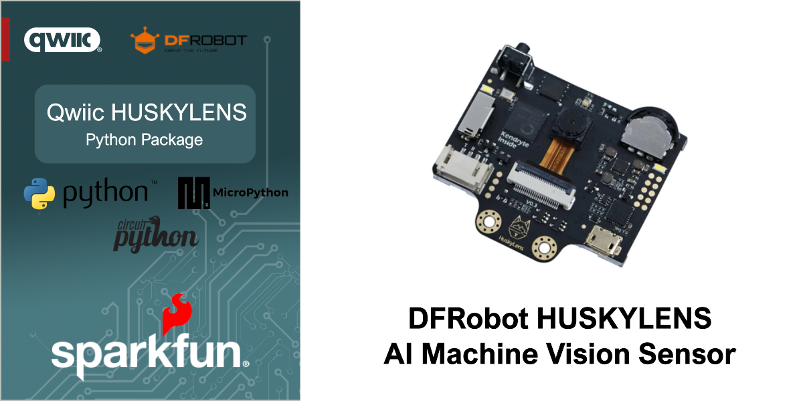

# SparkFun Qwiic HUSKYLENS - Python Package


[](https://docs.sparkfun.com/qwiic_huskylens_py/classqwiic__huskylens_1_1_qwiic_huskylens.html)

The DFRobot Huskylens Module provides a simple and cost effective solution for adding AI Camera capabilities to your project. Implementing an I2C interface, these sensors can be rapidly added to any project with boards that are part of the SparkFun Qwiic ecosystem.

This repository implements a Python package for the DFRobot Huskylens. This package works with Python, MicroPython and CircuitPython.

### Contents

* [About](#about-the-package)
* [Installation](#installation)
* [Supported Platforms](#supported-platforms)
* [Documentation](https://docs.sparkfun.com/qwiic_huskylens_py/classqwiic__huskylens_1_1_qwiic_huskylens.html)
* [Examples](#example-use)

## About the Package

This python package enables the user to access the features of the HUSKYLENS via a single Qwiic cable. This includes face recognition, object tracking, tag tracking, line tracking, classification and more. The capabilities of the HUSKYLENS are each demonstrated in the included examples.

New to qwiic? Take a look at the entire [SparkFun qwiic ecosystem](https://www.sparkfun.com/qwiic).

### Supported SparkFun Products

This Python package supports the following SparkFun qwiic products on Python, MicroPython and Circuit python. 

* [SparkFun AI Camera Sensor - HUSKYLENS](https://www.dfrobot.com/product-1922.html)

### Supported Platforms

| Python | Platform | Boards |
|--|--|--|
| Python | Linux | [Raspberry Pi](https://www.sparkfun.com/raspberry-pi-5-8gb.html) , [NVIDIA Jetson Orin Nano](https://www.sparkfun.com/nvidia-jetson-orin-nano-developer-kit.html) via the [SparkFun Qwiic SHIM](https://www.sparkfun.com/sparkfun-qwiic-shim-for-raspberry-pi.html) |
| MicroPython | Raspberry Pi - RP2, ESP32 | [SparkFun Pro Micro RP2350](https://www.sparkfun.com/sparkfun-pro-micro-rp2350.html), [SparkFun IoT RedBoard ESP32](https://www.sparkfun.com/sparkfun-iot-redboard-esp32-development-board.html), [SparkFun IoT RedBoard RP2350](https://www.sparkfun.com/sparkfun-iot-redboard-rp2350.html)
|CircuitPython | Raspberry Pi - RP2, ESP32 | [SparkFun Pro Micro RP2350](https://www.sparkfun.com/sparkfun-pro-micro-rp2350.html), [SparkFun IoT RedBoard ESP32](https://www.sparkfun.com/sparkfun-iot-redboard-esp32-development-board.html), [SparkFun IoT RedBoard RP2350](https://www.sparkfun.com/sparkfun-iot-redboard-rp2350.html)

> [!NOTE]
> The listed supported platforms and boards are the primary platform targets tested. It is fully expected that this package will work across a wide variety of Python enabled systems. 

## Installation 

The first step to using this package is installing it on your system. The install method depends on the python platform. The following sections outline installation on Python, MicroPython and CircuitPython.

### Python 

#### PyPi Installation

The package is primarily installed using the `pip3` command, downloading the package from the Python Index - "PyPi". 

Note - the below instructions outline installation on a Linux-based (Raspberry Pi) system.

First, setup a virtual environment from a specific directory using venv:
```sh
python3 -m venv path/to/venv
```
You can pass any path as path/to/venv, just make sure you use the same one for all future steps. For more information on venv [click here](https://docs.python.org/3/library/venv.html).

Next, install the qwiic package with:
```sh
path/to/venv/bin/pip3 install sparkfun-qwiic-huskylens
```
Now you should be able to run any example or custom python scripts that have `import qwiic_huskylens` by running e.g.:
```sh
path/to/venv/bin/python3 example_script.py
```

### MicroPython Installation
If not already installed, follow the [instructions here](https://docs.micropython.org/en/latest/reference/mpremote.html) to install mpremote on your computer.

Connect a device with MicroPython installed to your computer and then install the package directly to your device with mpremote mip.
```sh
mpremote mip install github:sparkfun/qwiic_huskylens_py
```

If you would also like to install the examples for this repository, issue the following mip command as well:
```sh
mpremote mip install github:sparkfun/qwiic_huskylens_py@examples
```

### CircuitPython Installation
If not already installed, follow the [instructions here](https://docs.circuitpython.org/projects/circup/en/latest/#installation) to install CircUp on your computer.

Ensure that you have the latest version of the SparkFun Qwiic CircuitPython bundle. 
```sh
circup bundle-add sparkfun/Qwiic_Py
```

Finally, connect a device with CircuitPython installed to your computer and then install the package directly to your device with circup.
```sh
circup install --py qwiic_huskylens
```

If you would like to install any of the examples from this repository, issue the corresponding circup command from below. (NOTE: The below syntax assumes you are using CircUp on Windows. Linux and Mac will have different path seperators. See the [CircUp "example" command documentation](https://learn.adafruit.com/keep-your-circuitpython-libraries-on-devices-up-to-date-with-circup/example-command) for more information)

```sh
circup example qwiic_huskylens\qwiic_huskylens_ex1_face_recognition_2d
circup example qwiic_huskylens\qwiic_huskylens_ex2_face_recognition_3d
circup example qwiic_huskylens\qwiic_huskylens_ex3_object_tracking
circup example qwiic_huskylens\qwiic_huskylens_ex4_object_recognition
circup example qwiic_huskylens\qwiic_huskylens_ex5_line_tracking
circup example qwiic_huskylens\qwiic_huskylens_ex6_color_recognition
circup example qwiic_huskylens\qwiic_huskylens_ex7_tag_recogntion
circup example qwiic_huskylens\qwiic_huskylens_ex8_object_classification
circup example qwiic_huskylens\qwiic_huskylens_ex9_write_to_screen
```

Example Use
 ---------------
Below is a quickstart program to print readings from the HUSKYLENS.

See the examples directory for more detailed use examples and [examples/README.md](https://github.com/sparkfun/qwiic_huskylens_py/blob/master/examples/README.md) for a summary of the available examples.

```python

import qwiic_huskylens 
import sys
import time

def runExample():
	print("\nQwiic Huskylens Example 1 - 2D Face Recognition\n")

	myHuskylens = qwiic_huskylens.QwiicHuskylens() 

	if myHuskylens.is_connected() == False:
		print("The device isn't connected to the system. Please check your connection",
			file=sys.stderr)
		return

	if myHuskylens.begin() == False:
		print("Failed to initialize the device. Please check your connection", file=sys.stderr)
		return

	myHuskylens.forget() # Forget all the faces that the device has already learned
	myHuskylens.set_algorithm(myHuskylens.kAlgorithmFaceRecognition) # The device has several algorithms, we want to use face recognition

	print("Lets teach the HuskyLens the first 2D face.")
	newName = input("Enter the name of the 2D face you are about to teach the lens: ")
	print("Please show the face to the camera. Will attempt to learn the face in 3 seconds.")
	time.sleep(3)

	myHuskylens.wait_for_objects_of_interest()

	myHuskylens.learn_new()
	myHuskylens.name_last(newName)
	print("Face learned!")

	print("Lets teach the HuskyLens the second 2D face.")
	newName = input("Enter the name of the 2D face you are about to teach the lens: ")
	print("Please show the face to the camera. Will attempt to learn the face in 3 seconds.")
	time.sleep(3)

	myHuskylens.wait_for_objects_of_interest()

	myHuskylens.learn_new()
	myHuskylens.name_last(newName)
	print("Face learned!")

	nScans = 0
	while True:
		myFaces = myHuskylens.get_objects_of_interest()
		if len(myFaces) == 0:
			print("No faces found")
		else:
			print("----------------------New Faces Scan #{}----------------------".format(nScans))

			for face in myFaces:
				name = myHuskylens.get_name_for_id(face.id) # The myHuskylens object keeps track of the names we have assigned this program run
				if name:
					print("Face Name: " + name)
				print ("Face ID: " + str(face.id))
				print ("Face X: " + str(face.xCenter))
				print ("Face Y: " + str(face.yCenter))
				print ("Face Width: " + str(face.width))
				print ("Face Height: " + str(face.height))
				print("\n")

				nScans += 1

		time.sleep(2)

if __name__ == '__main__':
	try:
		runExample()
	except (KeyboardInterrupt, SystemExit) as exErr:
		print("\nEnding Example")
		sys.exit(0)
```
<p align="center">

</p>
